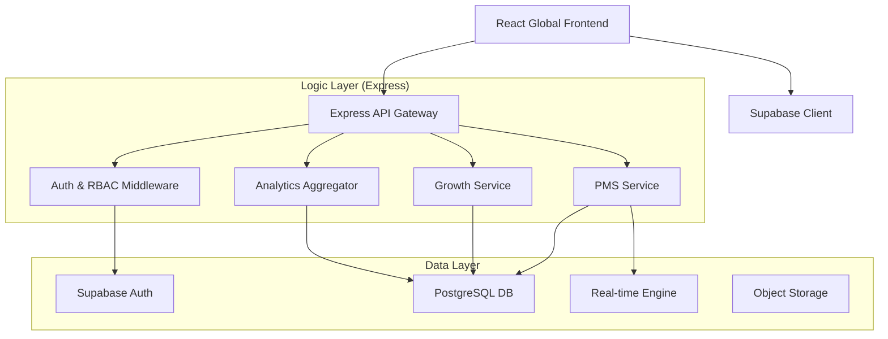

# Backend Architecture Plan - SchoolOS Platform

## 1. Executive Summary
This document outlines the complete backend architecture for the SchoolOS platform, transitioning from the current mock-based system to a robust, scalable, and hierarchical multi-tenant infrastructure. The architecture is designed to support high-concurrency educational tools, real-time project management, and deep system analytics.

---

## 2. Core Technology Stack
| Layer | Technology | Rationale |
|-------|------------|-----------|
| **Runtime** | Node.js (TypeScript) | Fast, non-blocking I/O for real-time operations and shared types with frontend. |
| **Framework** | Express.js | Mature, flexible framework for building modular RESTful APIs. |
| **Database** | Supabase (Postgres) | Managed relational database with built-in Auth, Real-time sub/pub, and Row Level Security (RLS). |
| **ORM** | Prisma | Automated migrations and type-safe database queries. |
| **Real-time** | Socket.io + Supabase Realtime | Hybrid approach: Socket.io for complex chat logic; Supabase for live data syncing. |
| **Caching** | Redis | High-speed storage for session data and analytics aggregation. |
| **Storage** | Supabase Storage (S3) | Secure bucket storage for user reports, avatars, and project attachments. |

---

## 3. High-Level Architecture (Hybrid Model)

The system follows a **Hybrid Serverless/Backend** model to leverage the speed of managed services while maintaining control over complex business logic.

---

## 4. Multi-Tenant Hierarchical Data Model
The project uses a **Single Database, Shared Schema** approach with strict **Row Level Security (RLS)**.

### Entity Hierarchy:
1. **Organization (The Root)**: Global management level.
2. **Schools (The Nodes)**: Progressive/Regulatory schools.
3. **Departments (The Sectors)**: Specialized divisions within schools (e.g., Engineering, Medical).
4. **Teams/Users**: The active workforce within departments.

### Database Schema (Key Tables):
- `profiles`: Extends Supabase Auth users with roles, avatars, and department linkage.
- `permissions_overrides`: Granular control per user.
- `schools`: Metadata for educational nodes.
- `departments`: Map of school-to-pms context.
- `projects/tasks`: Core PMS data related to a `department_id`.
- `growth_metrics`: Specialized data for Teacher/Leader dashboards.
- `conversations/messages`: Real-time chat archives.

---

## 5. Security & Access Control
- **Authentication**: JWT-based authentication via Supabase.
- **RBAC+**: 
    - **Role-Based**: SuperAdmin, ManagementAdmin, Admin, TeacherStaff, Guest.
    - **Context-Based**: Access restricted to specific Schools/Departments.
    - **Override-Based**: Specific permission flags (e.g., `analytics:view`) assigned to individual users.
- **RLS Policy Example**: `CREATE POLICY "User can only see projects in their department" ON projects FOR SELECT USING (id IN (SELECT project_id FROM user_departments WHERE user_id = auth.uid()));`

---

## 6. Module Specific Architectures

### A. PMS Module (Project Management Suite)
- **State Engine**: Transitions tasks through `Todo -> In Progress -> Review -> Done`.
- **Relational Integrity**: Deleting a project cascades to its tasks and reports.
- **Export Service**: Background workers (BullMQ or similar) to generate PDFs/Excel reports without blocking the main thread.

### B. Growth Hub Module
- **Real-time Sync**: Uses Supabase Realtime to push educational updates to Teachers/Leaders immediately.
- **Data Engine**: Aggregates teacher performance metrics and student engagement data.

### C. Analytics Engine
- **Processing**: Periodic cron jobs aggregate raw data into `daily_summaries` for high-performance reading on the Analytics Page.
- **Metrics**: Node usage, active sessions, system health heartbeat.

---

## 7. API Design Pattern (v1)
All endpoints follow the `/api/v1` prefix.
- `/auth/*`: Login, session management, identity verification.
- `/org/*`: School and Department list/management.
- `/pms/*`: Crud operations for projects, tasks, and calendar.
- `/growth/*`: Performance tracking and specialized educational audits.
- `/analytics/*`: High-speed summary endpoints for dashboards.

---

## 8. Development & Deployment Flow
1. **Local Development**: Node server + Dockered Postgres/Redis.
2. **Staging**: Vercel/Netlify for Frontend; Render/Fly.io for Backend; Supabase Staging Project.
3. **Production**: Auto-scaled instances with CI/CD pipeline triggering on `main` branch merges.
